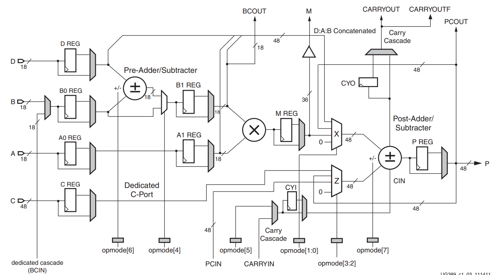

# Spartan-6-FPGA-DSP48A1-Slice

Explore the DSP48A1 slice in Spartan-3A FPGAs, designed to efficiently support DSP algorithms with minimal use of general FPGA logic. Key features include an 18-bit pre-adder, an 18x18 two’s complement multiplier, a 48-bit sign-extended adder/accumulator, and programmable pipelining. The architecture enables cascading results and input streams, enhancing the performance and efficiency of DSP filters.

## Features

- Core functionalities of the DSP48A1 slice:
  - Multiplication
  - Addition/Subtraction
  - Accumulation
  - Wide bus multiplexing
  - Magnitude comparison
  - Wide counters
- Verilog testbench for simulation and design verification

## Getting Started

To work with this project, a Verilog simulator supporting the Spartan-6 architecture is required. **QuestaSim** is recommended for optimal simulation.

### 1. Simulating the Design (using the `.do` file)

A `project.do` file is included to streamline the simulation process.

- Ensure proper setup of your simulator and project environment.
- To execute the simulation:
  - Load the source files in the tool and use the console command: `do project.do`
  **OR**
  - Open a terminal, navigate to the directory containing `run_sim.do`, and execute:
    - `source project.do` (Linux/macOS)
    - `project.do` (Windows)

  This script automates the compilation of Verilog files, runs the simulation using the testbench, and displays the waveform.

### 2. Manual Simulation (Optional)

You can also manually compile the source files and run the simulation through your simulator's interface if preferred.

### 3. Testbench Usage

- The testbench file (`DSP48A1.v`) includes example test cases for DSP48A1 operations.
- Modify the testbench to add more test vectors for thorough verification.

## Design Files

- `DSP48A1.v`: Top-level Verilog module for DSP48A1 slice implementation.
- `ff_mux.v`: Verilog implementation of the flip-flop and the MUX in the block diagram.
- `mux_4to1.v`: Verilog implementation of the 4x1 MUX.
- `DSP48A1_tb.v`: Verilog testbench for simulation and verification.
- `project.do`: Script for automating the simulation process.

## Block Diagram

